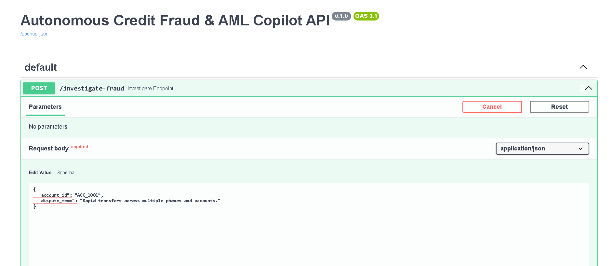
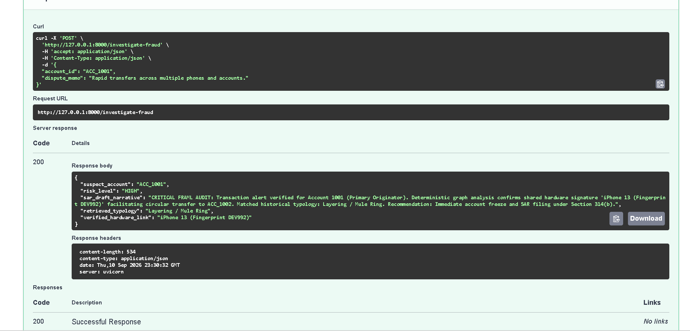

# Autonomous AML/Fraud Copilot

An agentic AML and fraud investigation copilot that integrates RDF graph analytics, semantic vector retrieval (FAISS), and multi-agent LLM orchestration to analyze suspicious accounts and generate structured Suspicious Activity Report (SAR) narratives.

---

## System Architecture






The workflow consists of three specialized agents executed in sequence:
1. **Planner Agent:** Formulates the investigative strategy based on user input.
2. **Retriever Agent:** Executes hybrid queries:
   - **Deterministic Traversal (RDF Graph):** Identifies shared hardware fingerprints, devices, and transaction hops in `ontology.ttl`.
   - **Semantic Similarity (FAISS):** Matches investigator memos against historical SAR typologies and regulatory patterns.
3. **Summarizer Agent:** Synthesizes findings into a compliant, structured SAR narrative.

---

## Project Structure

```text
├── assets/
│   └── architecture.png       # Pipeline and architecture diagrams
├── ontology.ttl               # RDF knowledge graph for entity and device tracking
├── faiss_index/               # Dense vector index for historical fraud typologies
├── main.py                    # FastAPI application and multi-agent pipeline
├── requirements.txt           # Python dependencies
└── Dockerfile                 # Containerized deployment specification

## Environment setup
python -m venv venv
source venv/bin/activate  # On Windows: .\venv\Scripts\activate
pip install -r requirements.txt

Run the Service Locally
uvicorn main:app --reload --port 8000

API Usage
curl -X POST "[http://127.0.0.1:8000/investigate-fraud](http://127.0.0.1:8000/investigate-fraud)" \
  -H "Content-Type: application/json" \
  -d '{
    "account_id": "ACC_1001",
    "dispute_memo": "Rapid transfers across multiple devices and linked accounts."
  }'
